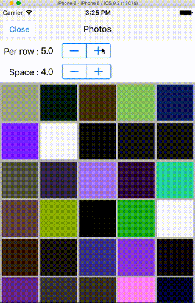

# BeautifulGridLayout
[](https://github.com/Carthage/Carthage)<br /><br />
UICollectionView extension for showing beautiful grid!

## Sample

<br /><br />
Demo is [here]()!

## Usage

- call `adaptBeautifulGrid:gridLineSpace(:sectionInset)` when you want to update.

```swift
collectionView.adaptBeautifulGrid(4, gridLineSpace: 2.0)

// If you want to set sectionInset
let inset = UIEdgeInsetsMake(0.0, 4.0, 0.0, 4.0)
collectionView.adaptBeautifulGrid(4, gridLineSpace: 2.0, sectionInset: inset)

```

## With Autolayout
If collectionView's frame changed by Autolayout, call `adaptBeautifulGrid:gridLineSpace(:sectionInset)` in `viewDidLayoutSubviews`.

```swift
override func viewDidLayoutSubviews() {
    super.viewDidLayoutSubviews()
    collectionView.adaptBeautifulGrid(4, gridLineSpace: 2.0)
    view.layoutIfNeeded()
}
```

## With Rotation

If Device'rotation changed, call `adaptBeautifulGrid:gridLineSpace(:sectionInset)` in `viewDidLayoutSubviews`.<br />

**e.g.** : Portrait→4, Landscape→6

```swift
override func viewDidLayoutSubviews() {
    super.viewDidLayoutSubviews()
    let isLandscape = UIDeviceOrientationIsLandscape(UIDevice.currentDevice().orientation)
    let perRow = 4 + (isLandscape ? 2 : 0)
    collectionView.adaptBeautifulGrid(perRow, gridLineSpace: 2.0)
    view.layoutIfNeeded()
}
```

## Requirements
- iOS 8.0+
- Xcode 7.0+(Swift 2+)

## Installation and Setup

### Carthage

- Add the following to your *Cartfile*:

```bash
github "sgr-ksmt/BeautifulGridLayout"
```

- Run `carthage update`
- Add the framework as described.
<br> Details: [Carthage Readme](https://github.com/Carthage/Carthage#adding-frameworks-to-an-application)

## Communication
- If you found a bug, open an issue.
- If you have a feature request, open an issue.
- If you want to contribute, submit a pull request. :)